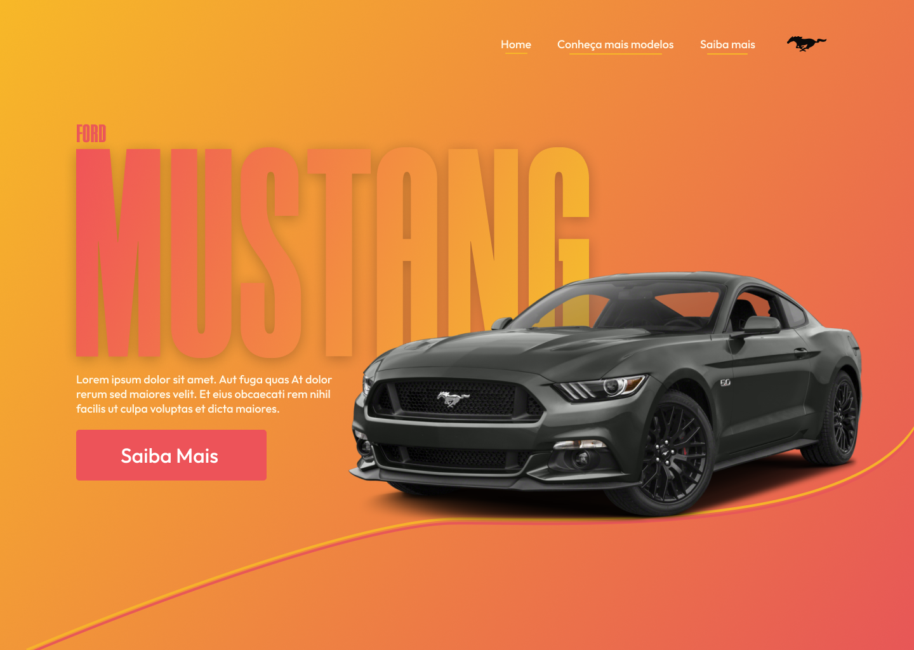

# Home-Mustang

Elaborei esta home page no intuito de praticar minhas habilidades no front-end e também no UI Design. Realizei a prototipação da home page no Figma onde consegui elaborar o posicionamento de cada elemento do layout na pagina. Após a criação do protótipo iniciei o projeto.

Você pode acessar: [Clique aqui.](https://davi-devroom.github.io/Home-Mustang/)

### Ferramentas:

 * Feito apenas com HTML, CSS e JavaScript, sem o uso de framework, protótipo feito em Figma e controle de versão com git.
